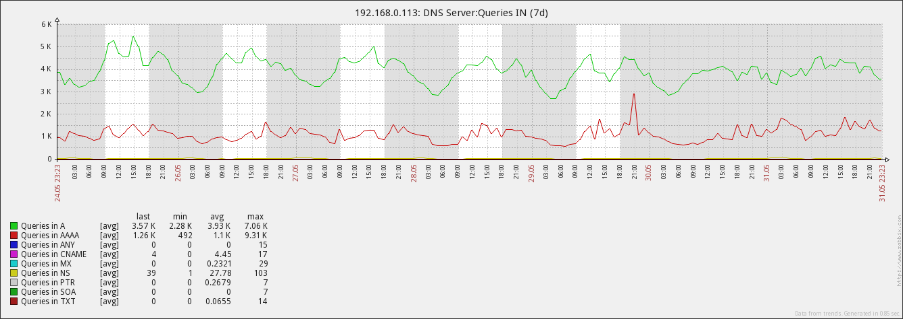

Zabbix DNS(BIND) Template
-------------------------

### BIND9 设置

通过*BIND*内置的 web server 提供的统计数据，作为监控数据源。需在*named.conf*加入以下行：

```
statistics-channels {
  inet 127.0.0.1 port 8053 allow { 127.0.0.1; };
};
```

### Zabbix 设置
在配置文件*zabbix_agentd.conf*添加：

```
UserParameter=bind.queries.in[*],curl http://127.0.0.1:8053/ 2>/dev/null | /usr/local/bin/xml2 | grep -A1 "/isc/bind/statistics/server/queries-in/rdtype/name=$1$" | tail -1 | cut -d= -f2
UserParameter=bind.queries.out[*],curl http://127.0.0.1:8053/ 2>/dev/null | /usr/local/bin/xml2 | grep -A1 "/isc/bind/statistics/views/view/rdtype/name=$1$" | tail -1 | cut -d= -f2
```

### Environment

 - BIND 9.9.x (Extended Support Version)
 - Zabbix server v2.4.1

### Screenshots

