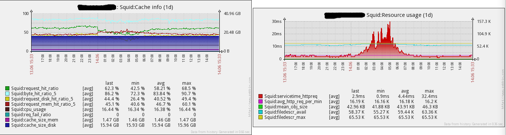

zbx_squid_template
-------------------

### 配置Squid
通过`squidclient`监控，需在*Squid*配置文件中添加相关参数：

```
acl localhost src 127.0.0.1/255.255.255.255
http_access allow manager localhost
http_access deny manager
cache_mgr noc@example.com
cachemgr_passwd yourpassword all
```
重启后可通过`/opt/squid/bin/squidclient -h 127.0.0.1 -p 80 -U noc@example.com -W yourpassword mgr:info`查看 Squid 状态。

### 配置Zabbix 
在配置文件*zabbix_agentd.conf*添加：
```
UserParameter=squid[*],/opt/zabbix/bin/squidcheck.sh $1
```


### Environment

 - Squid Cache: Version 2.6.STABLE23
 - Zabbix server v2.4.1

### Screenshots

